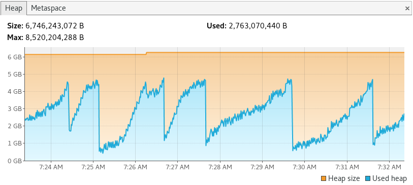

# Logstash Setup

Logstash is the 'L' in ELK, and it's the main data collector of the whole system. Conceptually, it's designed to monitor log file changes, listen for log events coming from many target services. This means that, usually, each event generates one document in ElasticSearch.

Our use case takes advantage of the enormous amount of plugins for Logstash and tunes its settings to a special type of logging: program logging. This means that we're indexing every single log line of every kernel that boots and all test logs that might occur for a specific tree/branch/kernel/defconfig/arch/compiler/lab. The amount of data is huge!

Given that, we needed important settings and tunning for Logstash to support our project.

## JVM tunning

During our research, we noticed that Logstash was crashing due to OOM constantly. We profiled it during many runs before coming up with a magical number of batch-size of `1` per `1` worker per every `6gb` of RAM. This is due to the nature of our [pipeline](kcing_pipeline.conf). It spans thousands of documents if the input type is a LAVA json file. The image below depicts a normal memory consumption pattern when Logstash is set to use at most 8g of RAM.

On average, LAVA json files are 100kb, but sometimes they can reach up to 800kb. The latter is responsible for spikes in the chart.

### JVM profiling

Steps below will guide you on how to profile Logstash using `visualvm` if you're running OpenJDK:
- install `visualvm`
- add to logstash java start up arguments: `-Dcom.sun.management.jmxremote.port=9777 -Dcom.sun.management.jmxremote.authenticate=false -Dcom.sun.management.jmxremote.ssl=false`
- start up logstash
- start visualvm: `visualvm --openjmx 172.18.0.2:9777`. This will open up a nice UI where you can monitor Logstash's JVM instance
