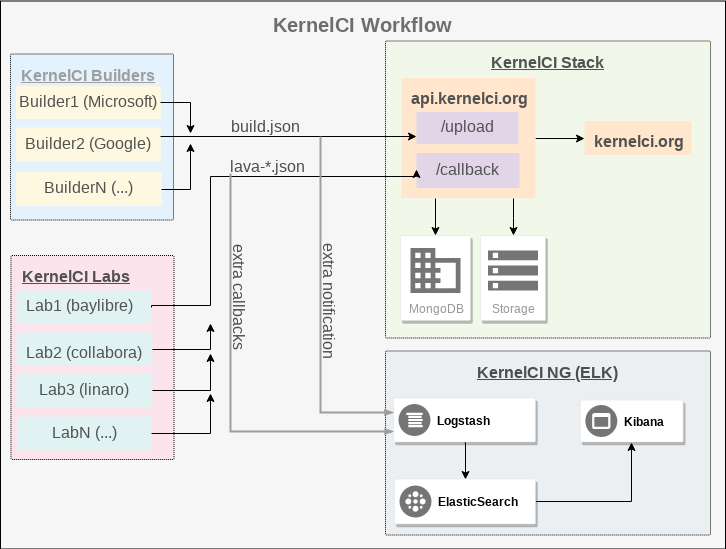

# KernelCI New Generation (visualization) - KCING

This repository contains scripts and configuration files to support prototype to a visualization tool using ELK for displaying [kernelci.org](https://kernelci.org) data. ELK stands for ElasticSearch, Logstash and Kibana.

The image above briefly shows the workflow of kernelci's build & boot infrastructure. `KernelCI Builders` are volunteer jenkins workers spreaded across the globe, running [kernelci-core](https://github.com/kernelci/kernelci-core) code to compile lots of Kernels. A master jenkins instance is run by kernelci maintainers to distribuite build workload. Once each builder has finished its job, it sends `api.kernelci.org/upload` the object file along with a `build.json` file containing metadata about the build just generated. The build is then saved into a MongoDB database and its artifacts saved in `storage.kernelci.org`.

With a build in hand, kernelci's jenkins will queue builds for booting/testing throughout [available labs](https://github.com/kernelci/kernelci-core/blob/master/labs.ini). Most of labs are running [LAVA](https://lavasoftware.org/). Each lab will then boot a build and run tests defined by kernelci maintainers. Lastly, labs will return boot/test results back to `api.kernelci.org/callback`, which saves to MongoDB and record results files named like `lava-json-board-name.json` into `storage.kernelci.org`. Once that loop has finished, the build and boot are publicaly available at `kernelci.org`.

## KCING

KCING currently acts as an alternative visualization tool for kernelci's jobs. Note from the image above that both `build.json` and `lava-*.json` files are also being sent to an extra stack. This is being worked out with kernelci maintainers to be available in the future. The files are received by a [Losgstash](https://www.elastic.co/products/logstash) instance, configured with [kcing_pipeline.conf](kcing_pipeline.conf).

During prototyping stage, we wrote `kcing.py` to emulate KernelCI Builders and Labs. It'll, daily, go to kernelci ajax api, query the past two days worth of boots and builds and use it to feed a running ElasticSearch instance. 

### Requirements

The kcing docker container runs ElasticSearch as the main program, therefore it requires a setting on the host machine so that the container runs properly. Based on the [official documentation](https://www.elastic.co/guide/en/elasticsearch/reference/current/vm-max-map-count.html#vm-max-map-count), you need to change `vm-max-map-count` setting:

    # sysctl -w vm.max_map_count=262144

That's all system requirements that are, besides getting [docker](https://docs.docker.com/install/linux/docker-ce/debian/) and docker-compose installed.

### Start up

Kcing has its own docker containing based off [Sébastien Pujadas](https://hub.docker.com/r/sebp/elk) great effort to manage to get the whole-most-up-to-date ELK stack up and running. The only changes from the original work are kernelci documents and kibana objects that are already saved to it. There's about 2500 documents in the ElasticSearch shard, with boots, builds and lava, a good amount to get started with.

Start up ELK container by:

    docker-compose up

And wait a few seconds/minutes for the whole thing fire up. Keep in mind that ELK is based of several JVM instances running at the same time, so please be patient.

### Important commands

Since kcing deals with the ELK stack, this means there are 3 different programs to keep track of configurations and running states. Use commands below for everyday management of your work.

#### Backup kibana objects

This might be the most important command to use because it allows different instances of kcing ELK stack to share the same visualizations. It works by exporting kibana's mappings and data straight out from ElasticSearch:

    ./kcing.py backup_kbn

That's it! It'll overwrite [kcing.kibana](kcing.kibana) (data) and [kibana.json](mapping_templates/kibana.json) (mappings), so please make sure to commit them and push it to the remote git server.

#### Restore kibana objects

This command is already run everytime the docker container is started, and it works as the opposite of the previous command:

    ./kcing.py setup_kbn

Please note that it *overwrites* your kibana's instance data and mappings. Be careful to run this command because you may lose data that you've been working on.

#### Get more data from kernelci

There's already about 2500 objects in the original container, but you're likely to get more data to work on. The script below does this the hard way, by querying kernelci website's raw data for boots and builds, working itself out to retrieve lava files from [storage.kernelci.org](https://storage.kernelci.org). That being said, availability of data depends on kernelci's websites.

Kcing comes with two ways of getting data: one that saves to `samples` directory, and another one that insert all data directly to ElasticSearch.

##### Inserting new data to ElasticSearch

Kcing inserts data by downloading a user-defined number of json files from *storage.kernelci.org* to a temporary directory, where later it submits in batch to a Logstash instance running [this](kcing_pipeline.conf) pipeline configuration.

    ./kcing.py feed_es

By default it'll crawl kernelci website and get the past two days worth of data. If you wish to limit that number, do so by passing `--how-many 42` to specify a number. Depending on the amount selected, it might take a while to download everything. Enable debugging `-d` in order to get more info on the screen during download.

It might be useful to get daily updates so that your instance would have same data as kernelci. Kcing has duplicate check feature that prevent downloading and adding files that were previously downloaded. Installing a cron job might be the way to go, just make sure kcing runs in its own directory. Also, logging what happened is possible by using `-l log_file` to save execution logs.

##### Downloading samples

This is useful want one needs to work on a single file, or sets of files repetitively. The data will be stored in `samples` folder.

    ./kcing.py gen_samples

Similar to first strategy, by default it gets past two days of data. Limit the amount of data by using `--sample_size 42` for your needs.

### List of available commands

- `./kcing.py feed_es [--how-many=N]` will attempt to download N (or last two days worth of data) lava files and builds from kernelci and submit them to a running ELK stack. Note that kcing runs a local sqlite database to keep track of what files were processed already so that duplicates don't exist in ElasticSearch. If you wish to clean this database, see `./kcing.py drp`.
- `./kcing.py gen_samples [--sample-size=N]` will attempt to download N (or last two days worth of data) lava files and builds recorded in kernelci website. Samples are stored in `samples` directory. 
- `./kcing.py drp [--drp-days N]` (data rentention policy) will remove the N (of defaults to `DRP_DAYS`) last days of processed data
- `./kcing.py test` will run available tests. For now, only `kernelci` tests are available

## Important parts of this repo

- `kcing.py` is the main file, responsible for calling other scripts
- `kernelci.py` contains all necessary code to retrieve boots and builds straight from kernelci.org while our patch allowing multiple callbacks isn't running on production kernelci.
- `feed_es.py` contains necessary scripting to get data sent to ES, overviewing LS/ES limitations

## Settings

Important settings that make kcing work properly are described below, they're present in `settings.py`. Please note that `settings.py` should NOT be changed, instead, write your settings to `local_settings.py`. Also it's worth mentioning that all the settings are also read from environment variables (overwrites `local_settings.py` and `settings.py`):

### KernelCI settings
- `KCI_HOST` host where to query data from kernelci, defaults to `kernelci`
- `KCI_SCHEME` scheme to use when making requests to `KCI_HOST`, defaults to `https`

### Logstash/ElasticSearch settings
- `ES_LAVA` and `ES_BUILD` urls where to post lava and build data to ES, respectivelly. This is usually a running Logstash instance, using [kcing_pipeline.conf](kcing_pipeline.conf) pipeline configuration.
- `ES_MAX_RETRIES` how many retries to post data to `ES_LAVA` or `ES_BUILD`, defaults to `3`
- `ES_LOAD_INTERVAL` is the number of seconds to sleep after every `LS_PIPELINE_BATCH_SIZE` objects are sent to ES, thus reducing load on logstash, defaults to `5`
- `LS_HOME` home is logstash's home folder, needed when customizing logstash `pipelines.yml` file
- `LS_QUEUE_TYPE` is lostash's queueing type: persisted (disk) or memory (ram), defaults to `persisted`
- `LS_PATH_CONFIG` is the pipeline configuration file path, defaults to [kcing_pipeline.conf](kcing_pipeline.conf)
- `LS_QUEUE_MAX_EVENTS` is the maximum number of unread events from the queue when `LS_QUEUE_TYPE` is set to `persisted`, defaults to `200`
- `LS_PIPELINE_BATCH_SIZE` is the maximum number of events a worker will collect from `inputs` section of the configuration file before starting `filters` and `outputs`, defaults to `100`
- `DRP_DAYS` is the number of days to keep processed data, defaults to `3`. 

## KernelCI matrix

As kernelci is intended to build, boot and test the maximum combinations possible of Linux Kernel trees. Each tree has selected branchs to be monitored.  

## What this is not

KCING is NOT intended to replace the kernelci builders, labs, regressions and bisections.
